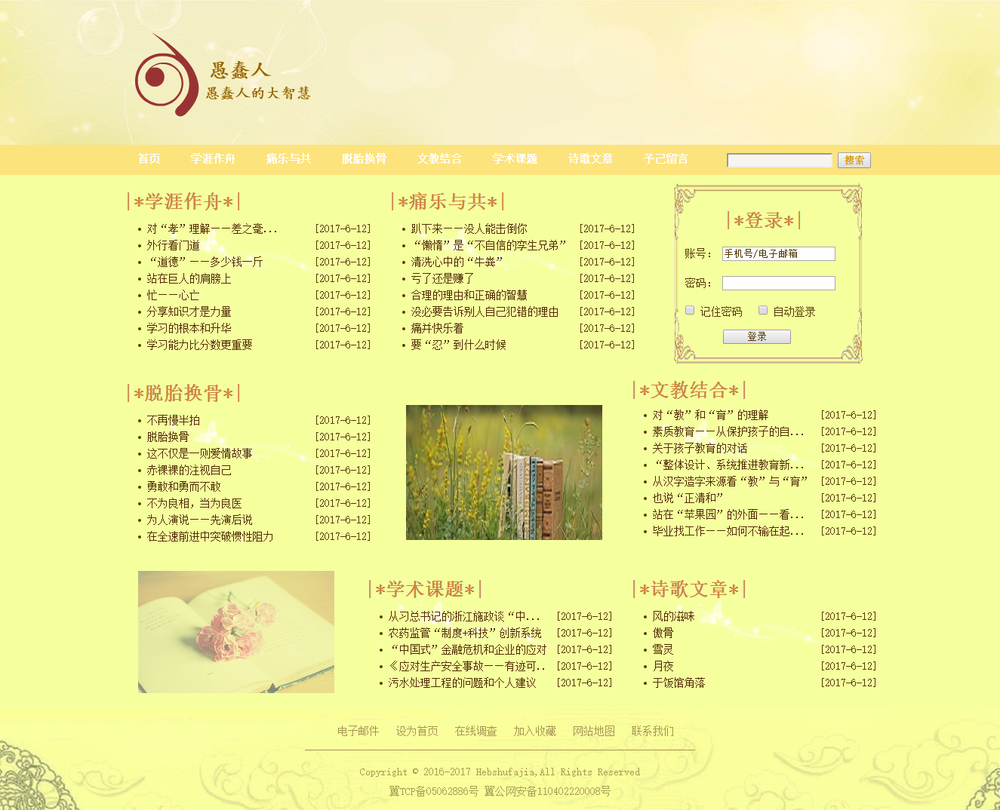
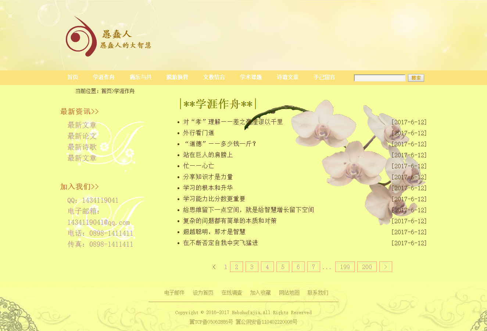
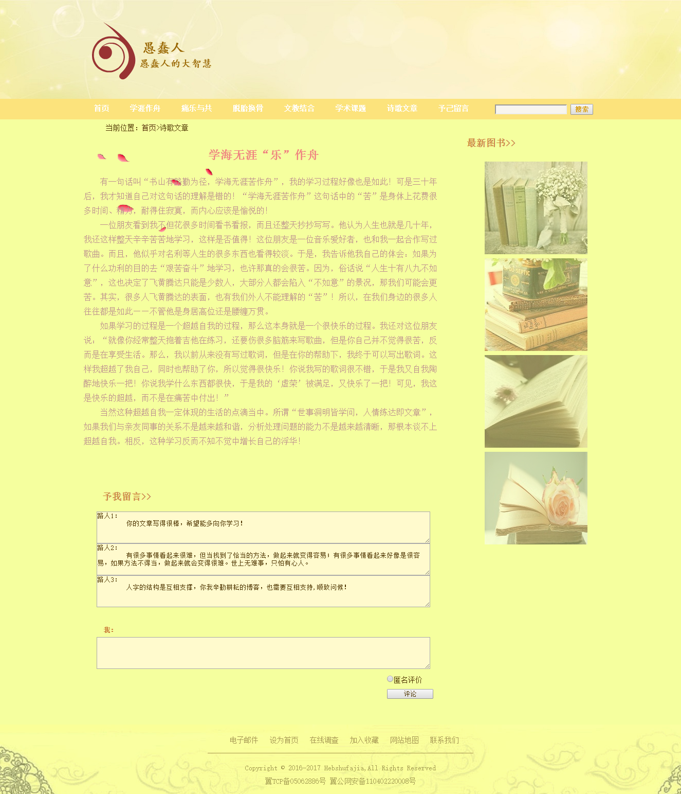
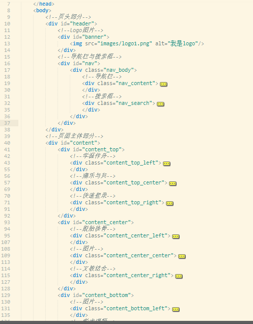
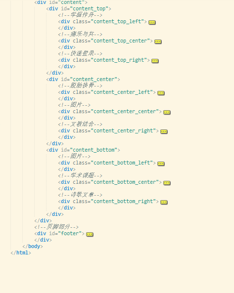
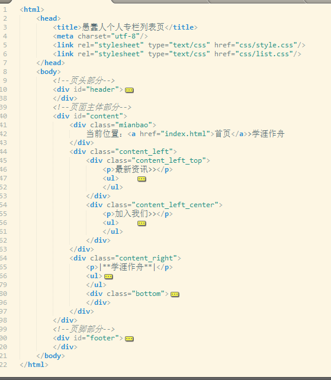
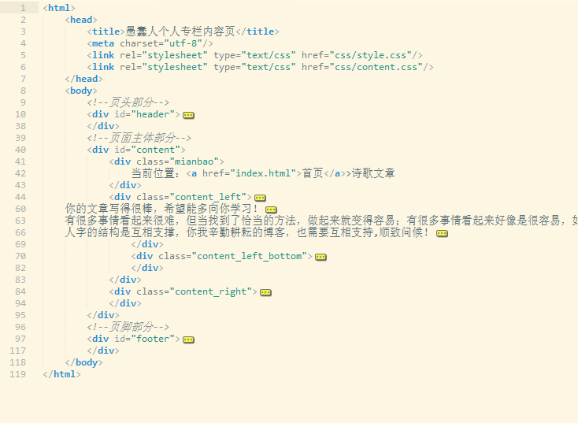
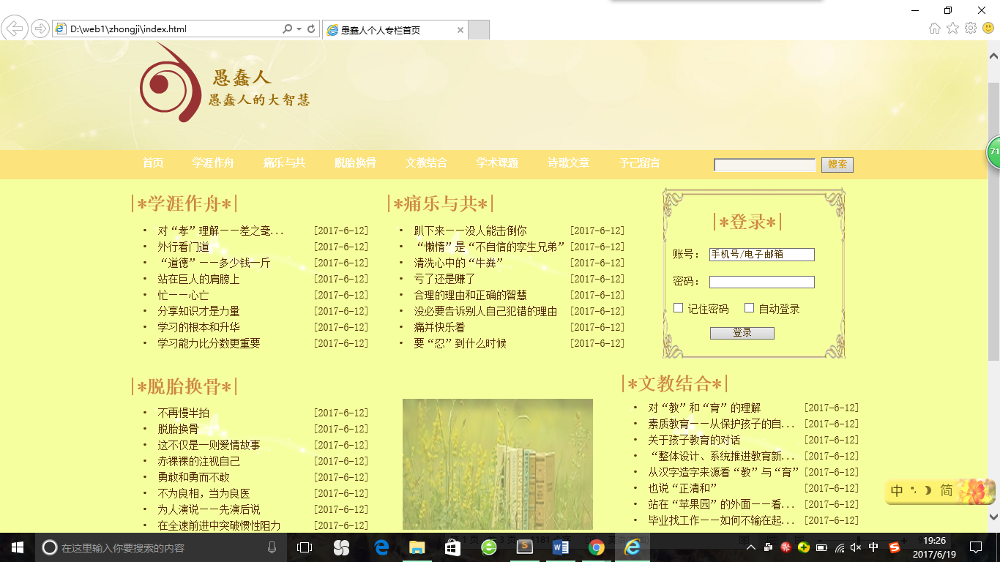
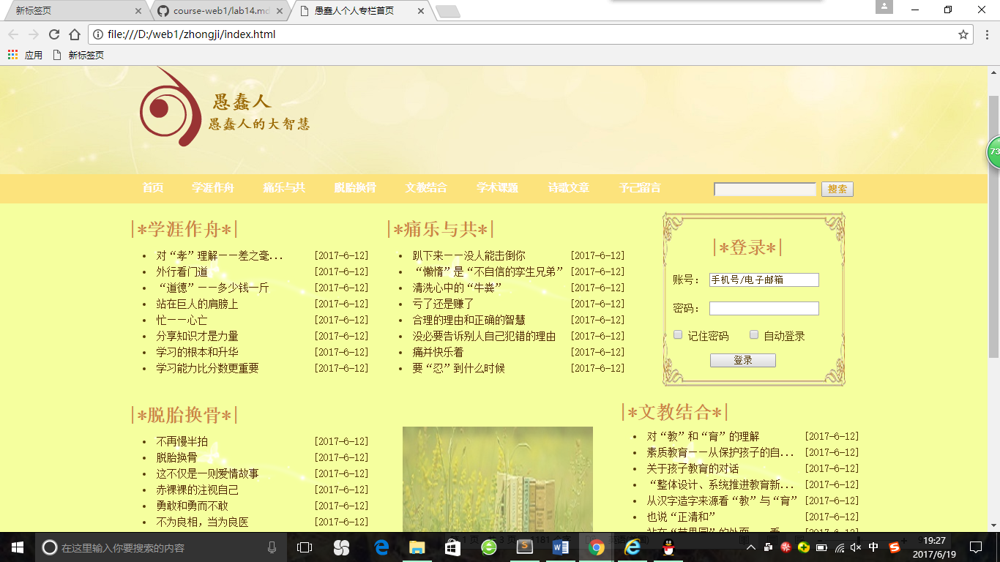
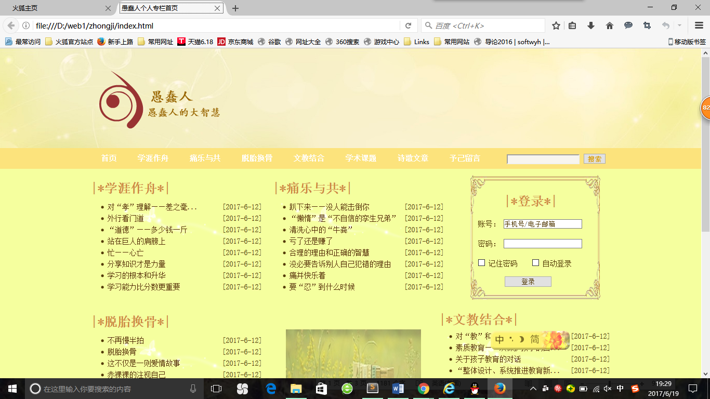

# web1作业课程设计提交说明  
## 课程名称：愚蠢人个人网站  
### 设计目的  
1.通过设计个人网站的作业来巩固课上学习的内容  
2.通过自己设计的网页对本学期的web课程进行一个总的知识总结  
3.通过自己所遇到的问题能更加清楚的了解设计网页过程中所会遇到的问题，用所学知识将其解决，学以致用  
4.更加熟练的掌握HTML在组织结构上的优势，css在网页布局中的应用，解决浏览器兼容性问题  
### 设计步骤  
#### 1.功能性需求分析  
该网站共有三个页面，其中每一个页面的屏幕截图及主要功能如下所列。  
（1）首页：  
屏幕截图：  
  
图一首页屏幕截图  
+ 主要实现功能：介绍该网站的功能，以及全面的展示该网站的所有页面  
+ 首页导航栏功能：有首页、学涯作舟、痛乐与共、脱胎换骨、文教结合、学术课题、诗歌文章、予己留言等八个栏目  
（2）二级页面：  
屏幕截图：  
  
图二列表页屏幕截图  
+ 主要实现功能：介绍该栏目所有的文章  
（3）三级页面：  
屏幕截图：  
  
图三内容页屏幕截图  
+ 主要实现的功能：详细的介绍该内容页的该篇文章  
#### 2.搜集网站素材  
#### 3.建立网站代码目录结构  
  
#### 4.编写HTML代码  
（1）首页部分：  
整体结构：核心源代码：  
  
  
（2）二级页面：  
  
（3）三级页面：  
  
#### 5.编写css布局及样式  
（1）css布局：  
核心技术：  
Float实现布局：对相应的块元素设置浮动，使得该元素固定在理想的位置中  
Position辅助布局：对难以掌控的块元素进行定位辅助，帮助其固定  
核心源代码：float:left;background-position:center top;  
（2）添加css样式：  
通用类属性：外边距、内边距、字体颜色、字体大小、超链接经过时的状态、无序列表前的符号形状  
背景相关属性：背景路径、背景定位、背景图像重复、背景颜色  
#### 6.调试浏览器兼容性  
+ 在IE中的表现：  
  
+ 在chrome中的表现：  
  
+ 在Firefox中的表现：  
  
### 问题记录  
+ 问题表现：在页面效果图中，部分文字或者图片的位置和自己所设定的位置不和  
+ 问题表现：有些图片大小不符合自己设置的标准，无法正常的插入到网页当中  
+ 问题表现：有些图片的格式并不符合网页背景图片格式  
+ 问题表现：文字或者图片的大小设定不正确，导致文字或者图片的丢失或者是浮动的位置不正确  
+ 问题表现：图片在编写的过程当中路径写错，图片无法正确显示  
### 设计总结  
1. 需求分析阶段的经验：在进行需求分析的过程中，要具体分析到网站的所有功能需求以及素材需求，保证网站功能需求的完整性，在寻找素材的过程中，一定要确保照片格式的正确性  
2. 编写HTML代码的经验：编写HTML代码之前，要先具体分析网站的总体结构，规划好网站的布局，分为页头，页面中心和页脚三个部分，再根据这三个部分的需求分析规划每隔位置的效果图，对其进行格式的划分，由大到小，由略到详  
3. CSS布局的经验：进行css布局的时候，要确定好各个网页的公共内容和特别内容，对于三个网页的公共内容，要专门设置一个css样式表进行布局，可以大大减少代码输入量  
4. 设置CSS样式经验：对css代码进行设置时，对于选择器的名称一定要起的有意义，让自己能看得懂，才能确保今后在大量的代码中查找错误或者改正中，更快速的找到自己想要修改的选择器  
5. 调整浏览器兼容性经验：在css编写之前，一定要进行通用样式设置，保证每个浏览器在调试的过程中都能找到适合该浏览器的宽度和高度  
6. Sublime Text使用经验：使用sublime text时，可以打开侧边栏选择自己所编辑的文件夹，方便今后查看不同代码是能更加方便快速的查找到相同目录下的文件  
### 课堂小结  
1. HTML内容：先写出html的基本架构，再通过div、表格、表单等元素对页面的整体的布局进行规划，通过对每个div设置选择器使其每个产生不同的页面效果，最后整体生成总的页面  
2. css内容：用css使得网页结构（内容）与样式分离，使用不同的选择器分别对不同的div进行样式的调整，最终形成整体的可观性  

 

