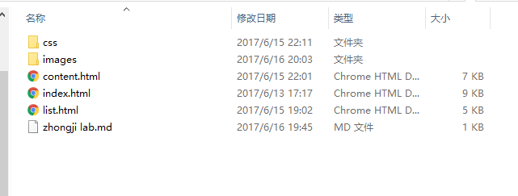

# web1作业课程设计提交说明  
## 课程名称：愚蠢人个人网站  
### 设计目的  
1.通过设计个人网站的作业来巩固课上学习的内容  
2.通过自己设计的网页对本学期的web课程进行一个总的知识总结  
3.通过自己所遇到的问题能更加清楚的了解设计网页过程中所会遇到的问题，用所学知识将其解决，学以致用  
4.更加熟练的掌握HTML在组织结构上的优势，css在网页布局中的应用，解决浏览器兼容性问题  
### 设计步骤  
#### 1.功能性需求分析  
该网站共有三个页面，其中每一个页面的屏幕截图及主要功能如下所列。  
（1）首页：  
屏幕截图：  
! [index.html] (/path/to/images/index.png)  
图一首页屏幕截图  
+ 主要实现功能：介绍该网站的功能，以及全面的展示该网站的所有页面  
+ 首页导航栏功能：有首页、学涯作舟、痛乐与共、脱胎换骨、文教结合、学术课题、诗歌文章、予己留言等八个栏目  
（2）二级页面：  
屏幕截图：  
  
图二列表页屏幕截图  
+ 主要实现功能：介绍该栏目所有的文章  
（3）三级页面：  
屏幕截图：  
  
图三内容页屏幕截图  
+ 主要实现的功能：详细的介绍该内容页的该篇文章  
#### 2.搜集网站素材  
#### 3.建立网站代码目录结构  
  
#### 4.编写HTML代码  
（1）首页部分：  
整体结构：核心源代码：  
  
  
（2）二级页面：  
  
（3）三级页面：  
  
#### 5.编写css布局及样式  
（1）css布局：  
核心技术：  
Float实现布局：对相应的块元素设置浮动，使得该元素固定在理想的位置中  
Position辅助布局：对难以掌控的块元素进行定位辅助，帮助其固定  
核心源代码：float:left;background-position:center top;  
（2）添加css样式：  
通用类属性：外边距、内边距、字体颜色、字体大小、超链接经过时的状态、无序列表前的符号形状  
背景相关属性：背景路径、背景定位、背景图像重复、背景颜色  
#### 6.调试浏览器兼容性  
 

